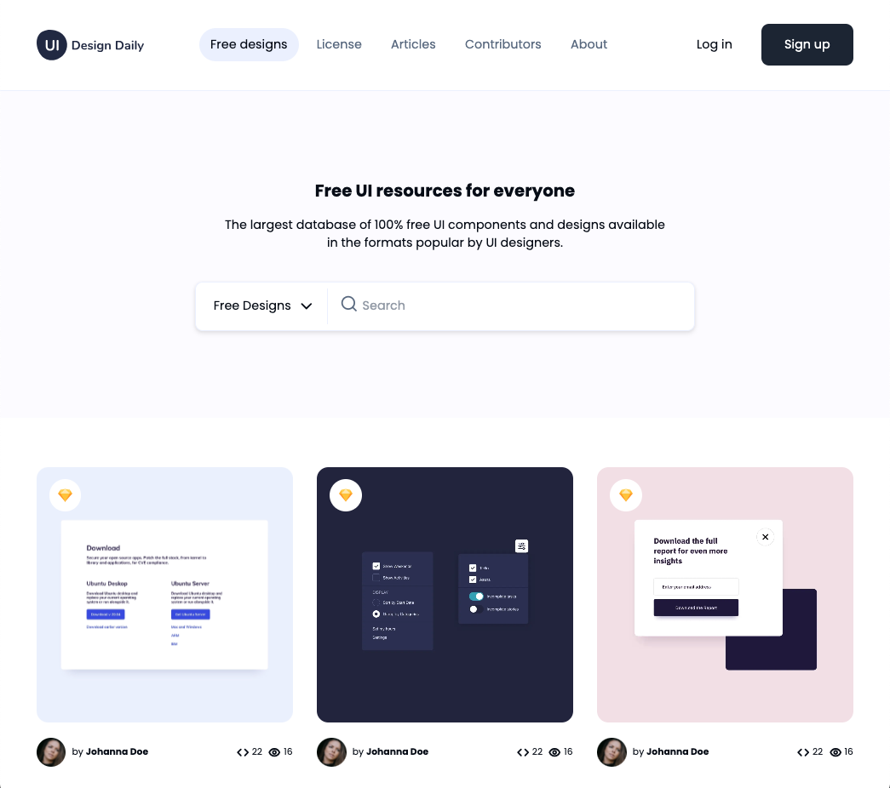

Welcome to the **Next.js & Tailwind CSS Web UI** repository! This project showcases a stunning web user interface built with Next.js and Tailwind CSS.

## 🚀 Demo

[Live Demo](https://your-live-demo-url.com)

## 📸 Screenshots



## 🛠 Features
- **Modern UI/UX**: Clean, sleek, and user-friendly interface.
- **Tailwind CSS**: Rapidly build custom designs without writing a lot of CSS.
- **Next.js**: Server-side rendering and static site generation for better SEO and performance.
- **shadcn-ui**: Speeding the development by using a builtin shadcn-ui component

## 📚 Technologies Used

- **Next.js**: A React framework for building server-side rendered and statically generated websites.
- **Tailwind CSS**: A utility-first CSS framework for rapid UI development.
- **JavaScript**: The programming language used to build the application.

## 📦 Getting Started

Follow these steps to get a local copy of the project up and running:

1. **Clone the repository:**
   ```bash
   git clone https://github.com/levisstrauss/tailwind-css-workshop-2.git
2. **Navigate to the project directory::**
   ```bash
   cd tailwind-css-workshop-2
3. **Install the dependencies::**
   ```bash
   npm install

4. **Install the dependencies::**
   ```bash
   npm run dev
